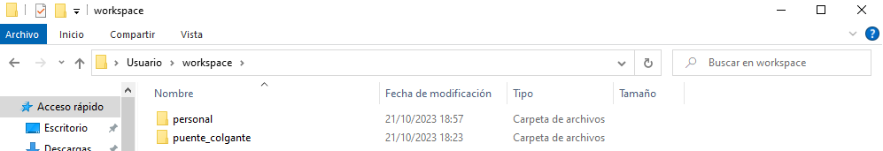
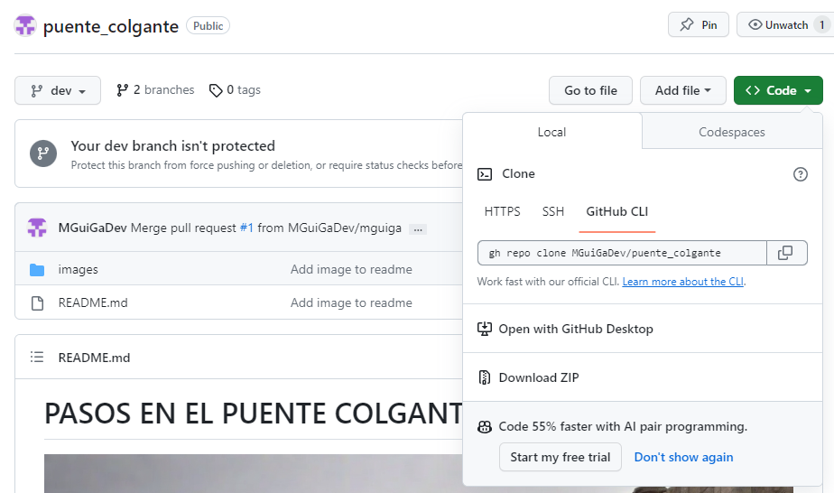

# PASOS EN EL PUENTE COLGANTE

## ¿Qué es el puente colgante?

> Aprender desarrollo web como si la empresa que nos ha contratado tuviera tiempo de enseñarnos.

## Empezar a aprender

1. Descargar e instalar [VS Code](https://code.visualstudio.com/)

    a. Instalar extensiones:

> HTML CSS Support, File & Folder Icons

2. Crear cuenta en [GitHub](https://github.com/login)

3. Descargar un proyecto en tu máquina y abrirlo en un navegador:

¿Necesitas ayuda?

- Instalar desde consola [Git](https://git-scm.com/book/es/v2/Inicio---Sobre-el-Control-de-Versiones-Instalaci%C3%B3n-de-Git)
- Instalar desde consola [GitHub CLI](https://www.kdnuggets.com/2023/03/getting-started-github-cli.html).
- Crear una carpeta workspace a la altura de tu usuario:

- En consola. Dentro de la carpeta workspace descargar este [proyecto](https://github.com/MGuiGaDev/puente_colgante). Clic en **Code**, seleccionar **GitHub Cli** y copiar comando.

4. Abrir el proyecto en VS Code.

¿Necesitas ayuda?

- Situarnos dentro de la carpeta workspace y ejecutar comando: ``gh repo clone MGuiGaDev/puente_colgante``.

- Entrar en el repositorio descargado: ``cd puente_colgante``.

- Ejecutar el siguiente comando: ``code .``.

5. Abrir el repositorio ejecutando el siguiente comando

